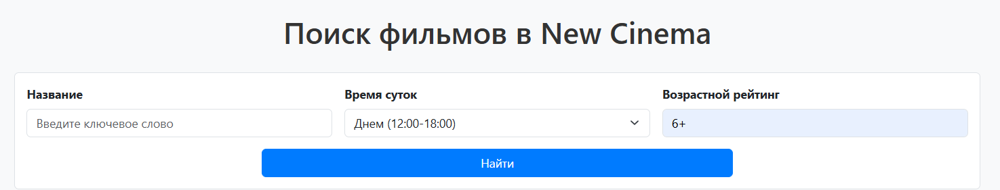
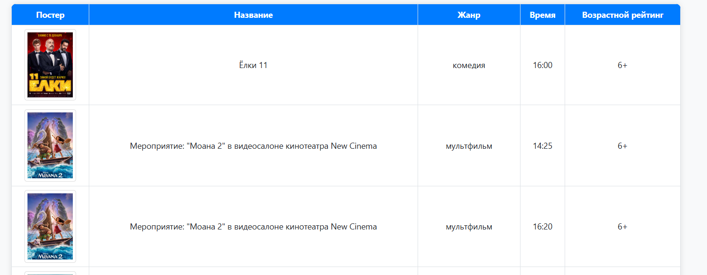

# New Cinema Filters

## Описание проекта
Реализован сервис по подбору сеансов, под указанные параметры.

## Функциональность

- **Поиск сеансов по названию:** Можно ввести название нужного фильма, сервис подберет сеансы по названию.
- **Поиск сеансов по времени суток:** Сервис подберет утренние, дневные или вечерние сеансы.
- **Поиск сеансов по возрастному ограничению:** Сервис подберет сеансы для заданного возраста.
- **Скрапинг данных:** Сервис автоматически собирает данные с сайта https://newcinema38.ru/.
- **Хранение данных:** Используется база данных SQLite, которая сохраняет сеансы между перезапусками сервиса, а также актуализирует данные каждые 30 мин.

## Как запустить проект

### Требования

- Git для работы с репозиторием.
- Установленный Docker и Docker Compose.
- Доступ к интернету.

### Инструкции по запуску

1. **Клонируйте репозиторий:**
```bash
git clone https://github.com/Rostyangrib/Review.git
cd your_project
```
2. **Запустите сервис:**
Выполните скрипт сборки и запуска:
```bash
./build.sh
```
()
3. **Откройте веб-приложение:** Перейдите в браузере по адресу https://localhost:5000.


4.  Вам будет доступна данная веб-страница. Вы можете использовать все доступные фильтры для подбора оптимального сеанса. После того как вы указали все нужные фильтры, нажмите кнопку "Найти".
5. Сервис покажет доступные сеансы.

## Как работает проект
1. **Скрапинг:** Сервис использует модуль Scrap.py для получения данных с сайта https://newcinema38.ru/.
2. **Обработка данных:** Полученные сеансы сохраняются в базу данных SQLite.
3. **Интерфейс:** Пользователь отправляет запрос по выбранным параметрам на веб-странице, а сервис ищет подходящие сеансы в базе.

## Структура проекта

- **app.py**: Сервер Flask
- **Scrap.py**: Сбор данных с сайта
- **database.py**: Создание и работа с базой данных.
- **index.html**: HTML-шаблон для отображения сайта
- **Dockerfile** и **docker-compose.yml**: Контейнеризация приложения
- **requirements.txt**: Зависимости проекта
